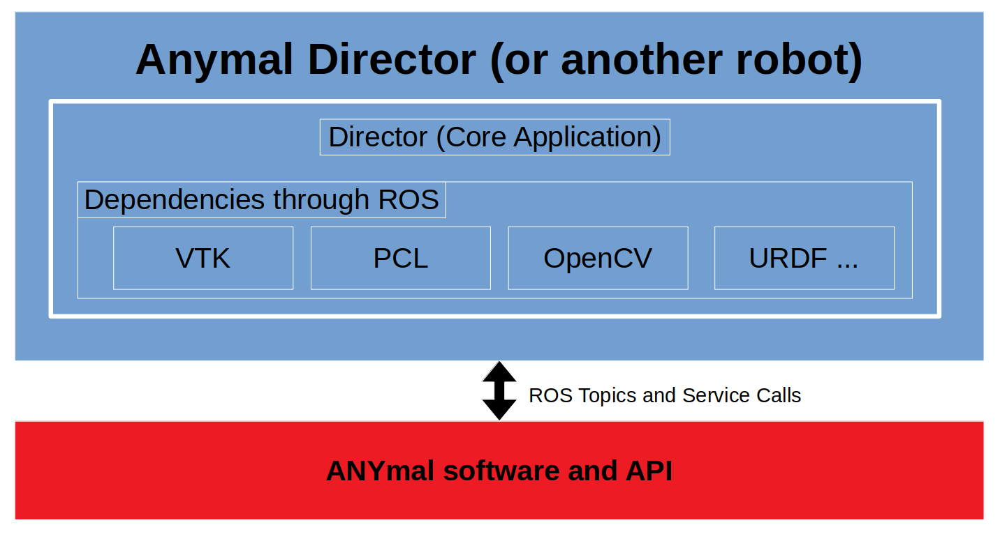

# ANYmal Director


# Introduction

This package contains a minimal user interface for operating the ANYmal robot. It builds upon and configures the core [Director UI](https://github.com/ori-drs/director) to be specific to ANYmal e.g. giving commands to the robot and drawing sensor signals from the robot.

View demo video with ANYmal simulator:

[](https://www.youtube.com/watch?v=ZX53VhNcAuA)

Director is a flexible, configurable robot user interface which is configured using Python. Development can be done without needing to recompile, which enables rapid integration. It is organised as follows:



# General Knowledge

The (Robot) Director is an interface for remote command and control of field robots.

It is built within ROS and uses VTK for rendering. Unlike Rviz it is convenient to adapt Director to be tightly integrated with a specific robot. VTK provides a modern scenegraph.

It's built upon a C++ base with the robot specific adaptation done in Python - making development of autonomy quicker.

System Requirements
-------------------

Currently the software is tested and used on Ubuntu 18.04 and ROS Melodic. ROS provides easy access to dependencies such as:

* PCL 1.8
* VTK 6.3
* OpenCV 3.2
* URDF/Xacro
* ROS messaging

By design, ROS is only minimally integrated and previous versions did not use ROS at all.

The original upstream (see below) is compatible and tested with MacOSX 10.11. In theory it can run on any platform where VTK and Qt are supported including Windows. It's been used on Ubuntu since 14.04.

# Install PCL
```
sudo apt install libpcl-dev
```
# Install VTK 6.3
```
sudo apt install cmake \
                  libavcodec-dev \
                  libavformat-dev \
                  libavutil-dev \
                  libboost-dev \
                  libdouble-conversion-dev \
                  libeigen3-dev \
                  libexpat1-dev \
                  libfontconfig-dev \
                  libfreetype6-dev \
                  libgdal-dev \
                  libglew-dev \
                  libhdf5-dev \
                  libjpeg-dev \
                  libjsoncpp-dev \
                  liblz4-dev \
                  liblzma-dev \
                  libnetcdf-dev \
                  libnetcdf-cxx-legacy-dev \
                  libogg-dev \
                  libpng-dev \
                  libqt5opengl5-dev \
                  libqt5x11extras5-dev \
                  libsqlite3-dev \
                  libswscale-dev \
                  libtheora-dev \
                  libtiff-dev \
                  libxml2-dev \
                  libxt-dev \
                  qtbase5-dev \
                  qttools5-dev \
		  qtmultimedia5-dev \
		  qtbase5-private-dev \
                  zlib1g-dev
		  
git clone https://github.com/Kitware/VTK.git
cd vtk
git checkout tags/v6.3.0
mkdir build
cd build
ccmake ..
```
press "c" to configure. If you get error like `"cc: error: ARGS: No such file or directory`, then change a line inside 2 files `GenerateExportHeader.cmake` and `vtkCompilerExtras.cmake`  from `string(REGEX MATCH "[345]\\.[0-9]\\.[0-9]*"` to `string(REGEX MATCH "[3456789]\\.[0-9]\\.[0-9]*"`.

when looks like the compiler stoped (at 95%) and the it will be written on screen that the compiler has produced the following output, press e to exit the screen. The following screen will be interactive and you can turn different flags to on and off. Make sure to turn of qt plugin to off as it needs qt version 4 for vtk version 6.3.0 to compile. Press "c" again to configure and "g" to generate output. Then do the following:
```
make -j4 
## Compiles the workspace

sudo make install  
## Installs (copies) the produced libraries and headers inside the system
```

* For newer version of vtk download and install from source, follow these 2 links: [link1](https://gist.github.com/ArghyaChatterjee/21c74b40eb1e795e949300ca8272866a) and [link2](https://www.cs.purdue.edu/homes/cs530/projects/project0.html)
* For installing vtk from binaries
```
pip install vtk==8.1.0
## For python version 2

pip3 install vtk==9.1.0
## For python version 3
```
# Cloning and Building

Please refer to the main Director instructions about dependencies and features. This software targets Ubuntu 18.04 and ROS Melodic.

To clone this module and its dependencies into a ROS workspace:

	mkdir -p anymal_director_ws/src
	cd anymal_director_ws
	catkin init
	catkin config --cmake-args -DCMAKE_BUILD_TYPE=Release
	cd src
	git clone git@github.com:ori-drs/director_anymal_b_simple.git
	source director_anymal_b_simple/scripts/clone_deps.sh
	cd ..

If you have a workspace, you can skip several of the steps above.

To build the software:

    source /opt/ros/melodic/setup.bash
	catkin build
	source devel/setup.bash

This should take about 90 seconds to compile.

Currently this environment variable is also needed:

	export DRC_BASE=$PWD/src/director_anymal_b_simple

# Running UI with ANYmal simulator

Launch a Gazebo simulator and the Director:

    roslaunch anymal_b_navigation_sim sim.launch
    roslaunch director_anymal_b_simple anymal_sim.launch

The usual ANYbotics ANYmal simulator will start. The robot will also be drawn in Director, as well as LIDAR and depth camera sensor data. See the video mentioned above.

In this basic version, you can only command the robot to 'square up', lie down and stand up.
There are quick key bindings to change view e.g. 'r' reset. 't' topview.

The python code for these actions is located in anymaldriverpanel.py. Start there for further development.

# Further Development

A more complete interface is available on request from Oxford Dynamic Robot Systems Group. It includes all the UI components which are disabled
in the version provided here and works in simulation and on the real robot. In addition to the core Director capabilites (see its readme), features specific to ANYmal Director include:

* An intuitive teleop interface with point-to-point pose control while trotting or walking
* An interactive Python interface to the ANYmal API
* Task execution and scheduling for autonomous missions

To make the full use of this software requires joining the [ANYmal Research Community](https://www.anymal-research.org/).

ANYbotics provide excellent control software, software releases and support for ANYmal within the ANYmal Research Community.
